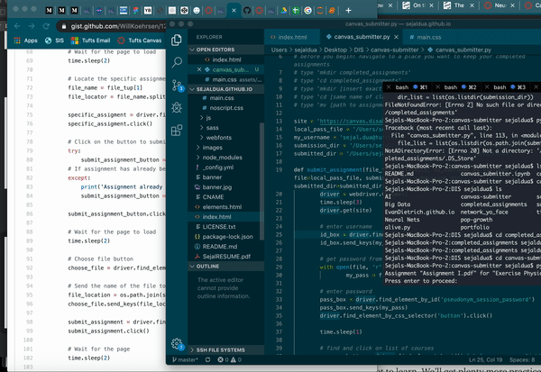

# canvas-submitter
Decided to procrastinate doing my assignment by automating the process of turning in the assignment after I read Will Koerhsen's awesome [Medium article](https://towardsdatascience.com/controlling-the-web-with-python-6fceb22c5f08)!

I wanted to take a spin in my new whip (Chrome Driver) somehow, so I decided to implement an automated Canvas submitter that works from Terminal because why go through the trouble of logging into Canvas, navigating to the course, clicking on the Assignment, selecting the file, etc.--I'm already tired--when I could just do all of that in code?

The changes I made to Will's code have to do with some HMTL quirks, as well as generalization so that the average GitHub stalker can use this function without expending much energy.

### Info

Hours spent: 3

Libraries used: 
* selenium: ```python from selenium import webdriver```
* os
* time
* datetime


### Usage

Before one even attempts to use the code, the following must be done:

1. You must [download Chrome Driver](https://sites.google.com/a/chromium.org/chromedriver/downloads)
2. In the terminal, type `sudo nano /etc/paths`

```python
try:
  make sure /usr/local/bin is there
except:
  write a row that says `/usr/local/bin`
save and quit via 'CTRL + X'
```
3. In your Downloads folder, type 'mv chromedriver /usr/local/bin'

In Terminal:

1. Navigate to a filepath where you want your assignments to live
2. type `mkdir completed_assignments`
3. type `cd completed_assignments`
4. type `mkdir [insert exact name of class here]`
5. type `cd [same name of class here]`
6. type `mv [path to assignment file] .`

Note: your life will be a whole lot easier if you name your file the name of the Canvas assignment + '.(file extension)

The five variables you will need to customize using your data / filepaths are: `site url`, `local_pass_file` where you write your password (you can protect it more if you wish), `username` which is essentially your email, `submission_dir`, and `submitted_dir`.

### The Function in Action




